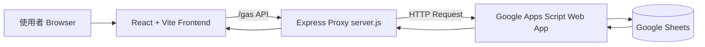

# BookMind 20 分鐘簡報（16 頁完整講稿）

## 使用方式
- 簡報長度：20 分鐘
- 建議節奏：前 12 頁共 15 分鐘；第 13 到 15 頁共 4 分鐘；第 16 頁 1 分鐘收尾與 QA
- 每頁包含：投影片內容、講者講稿、加分實作提示

---

## 第 1 頁｜封面：BookMind 系統介紹
### 投影片內容
- BookMind
- 個人書房與知識收錄管理系統
- React + Vite + Express + Google Sheets
- 報告者 / 日期

### 講者講稿（約 50 秒）
各位好，今天要介紹的是 BookMind，一個以個人知識管理為核心的系統。它的目標是把書籍、影集、文章等收藏資訊集中管理，並且可以持續追蹤閱讀進度與心得。技術上我們採用 React 和 Vite 建立前端，透過 Express 代理串接 Google Apps Script，最終資料落在 Google Sheets，兼顧開發效率與維護成本。

### 加分實作提示
- 背景建議用漸層搭配書櫃或便條紙紋理
- 封面副標加一句價值主張：讓收藏可管理，讓閱讀可追蹤

---

## 第 2 頁｜專案背景與痛點
### 投影片內容
- 收藏資料分散：筆記、瀏覽器書籤、社群收藏
- 難以統一查找與更新
- 缺乏閱讀進度與心得的結構化紀錄
- 需要低成本、可長期維護的方案

### 講者講稿（約 1 分 10 秒）
在日常閱讀中，我們會接觸到大量資訊來源，但資料常分散在不同工具裡，造成後續管理困難。想找一本之前收藏的書，可能要翻好幾個平台；想知道某主題讀到哪裡，也缺乏統一視圖。因此我們定義需求是：資料要集中、查找要快速、狀態要可追蹤，而且系統不能太重，否則很難長期使用。

### 加分實作提示
- 用三個痛點圖示呈現：分散、難找、難追蹤

---

## 第 3 頁｜系統目標與價值
### 投影片內容
- 建立單一入口管理收藏項目
- 支援新增、編輯、刪除、搜尋、篩選
- 同步保存到 Google Sheets
- 形成可回顧的閱讀歷程

### 講者講稿（約 1 分）
BookMind 的核心目標是把內容管理和閱讀管理整合在同一個流程中。第一，讓資料建立與維護變簡單；第二，讓搜尋與篩選能快速定位內容；第三，讓閱讀狀態、進度、評分、心得都能結構化保存。這樣不只是收藏清單，而是可持續演進的個人知識庫。

### 加分實作提示
- 右側放一句總結：從收藏工具升級為知識管理流程

---

## 第 4 頁｜使用者與典型使用情境
### 投影片內容
- 目標使用者：個人學習者、知識工作者、閱讀者
- 情境 A：看到新書立即入庫
- 情境 B：閱讀中更新進度與心得
- 情境 C：依主題或標籤快速回顧

### 講者講稿（約 1 分）
我們主要服務的是有持續閱讀或知識整理需求的使用者。典型流程是先快速入庫，先把資料收進來；第二步在閱讀過程中逐步補完狀態、進度和評分；第三步透過搜尋與篩選做主題回顧。這三個動作串起來，就形成一個完整的個人知識循環。

### 加分實作提示
- 用時間軸視覺：收錄 -> 閱讀 -> 回顧

---

## 第 5 頁｜系統架構總覽（加分項目 1：架構圖）
### 投影片內容
- 前端：React + Vite
- 代理層：Express（本地代理伺服器）
- 服務層：Google Apps Script Web App
- 資料層：Google Sheets

### 圖示（可直接貼到支援 Mermaid 的簡報工具）

### 講者講稿（約 1 分 20 秒）
這頁是整體架構。使用者在前端操作後，API 請求會先進入 Express 代理，再由代理轉送到 Google Apps Script，最後讀寫 Google Sheets。這樣設計有三個好處：第一，前端不直接暴露 Script 端點；第二，可在代理層統一處理錯誤與日誌；第三，資料仍可在 Sheets 上被人工檢視，維護門檻低。

### 加分實作提示
- 動畫順序：先亮前端，再亮代理，再亮 Apps Script，最後亮 Sheets

---

## 第 6 頁｜技術選型與設計理由
### 投影片內容
- React：元件化、狀態管理清晰
- Vite：啟動快、HMR 快速
- Tailwind CSS：統一樣式、開發效率高
- Express：輕量代理與路由控制
- Google Apps Script + Sheets：低成本雲端資料方案

### 講者講稿（約 1 分）
技術選型以實用與維運效率為主。React 提供可維護的元件架構，Vite 加速開發迭代。Tailwind 能快速產生一致 UI。後端不做重型服務，而是用 Express 當代理，把雲端邏輯交給 Apps Script，資料放在 Sheets，方便直接查看與管理。這組合非常適合個人或小團隊的中小型系統。

### 加分實作提示
- 以決策矩陣呈現：學習成本、開發速度、維護成本

---

## 第 7 頁｜資料流程（加分項目 2：動畫步驟）
### 投影片內容
1. 使用者在前端新增或修改資料
2. 前端組裝 JSON payload
3. 請求經由 /gas 送往 Apps Script
4. Apps Script 寫入或更新 Google Sheets
5. 前端重新拉取資料並渲染卡片

### 講者講稿（約 1 分 20 秒）
這個流程是 BookMind 的核心運作路徑。前端先收集欄位，封裝成 JSON 後送到代理，代理再轉給 Apps Script 寫入 Sheets。成功後前端會重新讀取最新資料，確保畫面和資料源一致。也就是說，使用者看到的每張卡片都反映最新的儲存狀態。

### 動畫實作指引（PowerPoint / Google Slides）
- Build 1：顯示步驟 1 與前端框
- Build 2：顯示步驟 2，payload 箭頭由前端指向代理
- Build 3：顯示步驟 3，箭頭延伸到 Apps Script
- Build 4：顯示步驟 4，Sheets 亮起
- Build 5：顯示步驟 5，回傳箭頭與卡片區更新

---

## 第 8 頁｜核心功能 A：新增與編輯（加分項目 3：截圖頁 1）
### 投影片內容
- 左側表單快速輸入：書名、作者、來源、分類、標籤
- 支援閱讀狀態、進度、評分、心得
- 點擊卡片可進入編輯模式，完成後更新

### 建議截圖
- 截圖內容：左側表單 + 右側卡片列表同框
- 截圖註解：標出必填欄位、編輯入口

### 講者講稿（約 1 分）
在操作設計上，我們把新增和編輯都做成低摩擦流程。使用者可先快速填必要欄位完成入庫，之後再逐步補充詳細資訊。當使用者點擊既有卡片，就能進入編輯模式，避免跳頁切換造成中斷。

### 加分實作提示
- 加上兩個 Callout：快速入庫、卡片即編輯

---

## 第 9 頁｜核心功能 B：搜尋與篩選（加分項目 3：截圖頁 2）
### 投影片內容
- 關鍵字搜尋：書名、作者、標籤
- 條件篩選：分類、閱讀狀態
- 結果即時縮小，提升查找效率

### 建議截圖
- 截圖內容：搜尋框輸入關鍵字 + 篩選下拉選單
- 截圖註解：顯示篩選前後卡片數量變化

### 講者講稿（約 1 分）
當資料量變大後，搜尋與篩選是使用效率關鍵。BookMind 支援以文字快速查找，也可透過分類和狀態交叉篩選。這讓使用者在回顧某一主題時，不必手動翻閱全部卡片。

### 加分實作提示
- 製作前後對照：篩選前 20 筆，篩選後 4 筆

---

## 第 10 頁｜核心功能 C：閱讀管理與心得（加分項目 3：截圖頁 3）
### 投影片內容
- 記錄閱讀狀態與進度百分比
- 記錄評分與入庫日期
- 支援 Markdown 心得渲染

### 建議截圖
- 截圖內容：單一卡片展開，含進度、評分、心得區塊
- 截圖註解：標示 Markdown 呈現效果

### 講者講稿（約 1 分）
BookMind 不只管理清單，更重視閱讀歷程。透過狀態、進度、評分和心得，使用者可以回看當下判斷與學習重點。Markdown 支援也讓心得更有結構，從純文字備註提升成可讀性較高的知識筆記。

### 加分實作提示
- 用一段三行 Markdown 範例，旁邊放渲染後畫面

---

## 第 11 頁｜操作流程示範（端到端）
### 投影片內容
- Step 1：輸入新項目
- Step 2：儲存並寫入資料
- Step 3：回到列表確認新增結果
- Step 4：再編輯並更新心得

### 講者講稿（約 1 分）
這頁建議做成短 Demo 動線圖。先新增一筆，再確認卡片出現，接著開啟編輯補上心得，最後再次儲存。觀眾會很快理解這不是一次性輸入，而是可持續補完的知識管理流程。

### 加分實作提示
- 用同一筆資料貫穿四步，提升故事連續性

---

## 第 12 頁｜後端代理與可靠性設計
### 投影片內容
- Express 代理統一處理 API 路由
- 可集中記錄錯誤與請求日誌
- 降低前端直接串接外部服務風險
- 為後續驗證與權限控管預留空間

### 講者講稿（約 1 分）
代理層的價值不只是轉送請求，更是系統治理節點。當串接失敗時，我們可以在代理層快速定位問題，也能擴充日誌與驗證邏輯。這讓整體架構在維持輕量的同時，仍具備可演進性。

### 加分實作提示
- 放一張錯誤處理流程小圖：前端錯誤 -> 代理紀錄 -> 回傳可讀訊息

---

## 第 13 頁｜環境設定與部署啟動
### 投影片內容
- 安裝依賴：npm install
- 啟動前端：npm run dev
- 啟動代理：npm run backend
- 環境變數：PORT、GOOGLE_APP_SCRIPT_URL

### 講者講稿（約 1 分）
啟動流程非常直接。前端與代理可分別啟動，方便本機開發。環境變數只需管理埠號與 Apps Script URL，部署與移轉成本都很低。這種設計有利於快速試錯與持續迭代。

### 加分實作提示
- 顯示 .env 範例並遮蔽敏感資訊

---

## 第 14 頁｜成效與限制（加分項目 4：雙欄對照）
### 投影片內容
| 成效（What works） | 限制（Current limits） |
|---|---|
| 收藏資料集中管理 | 目前以單使用者為主 |
| 搜尋與篩選效率提升 | 權限控管仍可加強 |
| 閱讀進度與心得可追蹤 | 缺少視覺化分析儀表板 |
| 維運成本低、可快速迭代 | 大規模高併發非主要場景 |

### 講者講稿（約 1 分 20 秒）
這頁採用雙欄是為了誠實呈現現況。左欄是目前已證明有效的價值，右欄是下一階段要補強的方向。這種呈現方式有助於讓利害關係人快速判斷：現在可用到什麼程度，以及投資下一步會帶來什麼收益。

### 加分實作提示
- 左欄用綠色系，右欄用琥珀色系，形成清楚對比

---

## 第 15 頁｜未來規劃 Roadmap
### 投影片內容
- 短期：資料驗證、錯誤提示、匯入匯出
- 中期：儀表板（閱讀量、分類分布、完成率）
- 中長期：帳號系統、權限角色、跨裝置同步

### 講者講稿（約 1 分）
未來規劃分三層。短期先補使用穩定性與資料治理；中期做可視化分析，讓管理效率再提升；中長期再導入多使用者能力。這樣可確保每一階段都能交付可見價值，而不是一次做過重改造。

### 加分實作提示
- 用三階段時間軸：Now / Next / Later

---

## 第 16 頁｜結論與 QA
### 投影片內容
- BookMind 已建立完整的知識收錄與閱讀管理流程
- 架構輕量、可用、可擴充
- 下一步聚焦資料治理與體驗升級
- Q and A

### 講者講稿（約 1 分）
總結來說，BookMind 已經把收錄、管理、回顧三件事串成可持續的流程。它的技術架構兼顧效率與可維護性，適合個人與小型團隊落地。接下來會聚焦在資料治理、可視化與多使用者擴充。以上是我的分享，歡迎提問。

### 加分實作提示
- 結尾可回扣封面價值句，形成前後呼應

---

## 附錄 A｜20 分鐘口說時間配置建議
- 第 1 到 4 頁：4 分鐘
- 第 5 到 7 頁：4 分鐘
- 第 8 到 12 頁：7 分鐘
- 第 13 到 15 頁：4 分鐘
- 第 16 頁：1 分鐘

## 附錄 B｜實作清單（照這份做可完成加分項目）
- 架構圖：第 5 頁放 Mermaid 圖，依節點逐段動畫
- 流程動畫：第 7 頁用 Build 1 到 Build 5
- 三張截圖：第 8 到 10 頁，含註解框與箭頭
- 雙欄對照：第 14 頁用表格，色彩區分成效與限制

## 附錄 C｜截圖拍攝腳本（建議）
- 截圖 1（新增編輯）：先輸入新資料，保持表單與卡片同框
- 截圖 2（搜尋篩選）：輸入關鍵字並套用分類篩選
- 截圖 3（閱讀管理）：開啟單一卡片，顯示進度與 Markdown 心得
